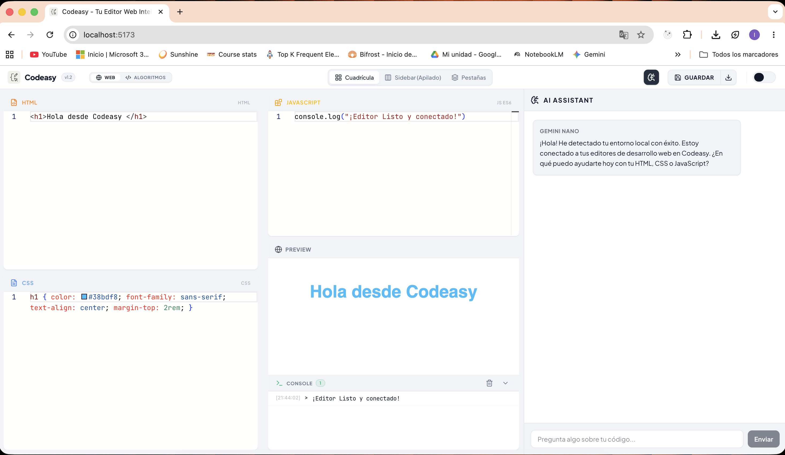

# Codeasy - Online Code Editor & Local AI Sandbox

Codeasy es un entorno de desarrollo interactivo (IDE) ultraligero que se ejecuta completamente en el navegador. Está diseñado tanto para el prototipado rápido y diseño web, como para la resolución intensiva de algoritmos lógicos, todo ello potenciado por Inteligencia Artificial Local (Gemini Nano) sin depender de servidores en la nube.



## 🌟 Características Principales

### 1. Modos de Desarrollo Independientes (Web & Algoritmos)
El editor se adapta a tu tarea actual, aislando tanto el código como el contexto de la interfaz:
*   **Modo Desarrollo Web:** Editores de `HTML`, `CSS` y `JavaScript` en vivo. El resultado se renderiza instantáneamente en un `iframe` seguro. Ofrece Layouts ajustables:
    *   **Cuadrícula:** Paneles equilibrados y clásicos.
    *   **Pestañas:** Espacio maximizado para concentrarte en un lenguaje a la vez.
    *   **Columnas (Sidebar):** Editores apilados a la izquierda para aprovechar monitores ultra panorámicos.
*   **Modo Algoritmos:** Interfaz minimalista enfocada al 100% en JavaScript. Oculta HTML y CSS, priorizando una **Consola Integrada** en tiempo real capaz de interceptar logs y errores no controlados. El código de Algoritmos persiste independientemente del de Web.

### 2. Asistente de IA Local (Chrome Built-in AI)
Cuenta con un panel de IA integrado (AiAssistantPanel) que utiliza la Prompt API de Google (`window.ai`) para correr Gemini Nano directamente en tu hardware:
*   **Privacidad Total:** Tu código nunca abandona tu dispositivo. 
*   **Inyección de Contexto Inteligente:** La IA sabe exactamente en qué modo estás. En modo Web analiza tu HTML, CSS y JS; en modo Algoritmos analiza puramente tu lógica en JS.
*   **System Prompts Adaptativos:** La IA cambia su personalidad y enfoque de asistencia dependiendo de si estás diseñando una interfaz o si estás batallando con una prueba de código duro.

### 3. Novedad: Historial de Conversaciones Persistente
La más reciente incorporación al Asistente de IA:
*   **Sidebar de Historial:** Las conversaciones ya no se pierden al recargar. Se guardan y se muestran en un panel lateral agrupadas por el Modo de Desarrollo actual.
*   **Títulos Autogenerados:** La IA genera de manera asíncrona un título corto e inteligente basándose en tu primer mensaje para cada nueva conversación.
*   **Persistencia:** Gestionado globalmente con **Zustand `persist`**, todo queda guardado en `localStorage`.

### 4. Sistema Ágil de Exportación y Descarga
*   **Guardar:** Sistema de almacenamiento constante y aislamiento de código en `localStorage`. 
*   **Exportar como `.zip`:** Descarga tu entorno Web enlazado de forma estándar (`index.html`, `style.css`, `script.js`).
*   **HTML Único Compilado:** Genera con un solo clic tu proyecto completo inyectado en un único archivo HTML para pruebas offline.

### 5. Interfaz y Herramientas Profesionales
*   **Motor Monaco Editor:** La misma base que VS Code, ofreciendo IntelliSense y atajos nativos.
*   **Emmet Integrado:** Para desarrollo web HTML y CSS veloz.
*   **Driver.js:** Sistema de tutoriales integrados para guiar al usuario por la interfaz.

---

## 🛠 Tecnologías Utilizadas (Stack)

*   **Core / UI:** React 19, TypeScript, Vite.
*   **Estilado:** Tailwind CSS v4, Lucide React (Iconografía).
*   **Estado Global:** Zustand v5 (Arquitectura de Stores e hidratación de datos persistentes).
*   **Editores de Código:** `@monaco-editor/react`, `emmet-monaco-es`.
*   **IA & Utilidades:** Chrome Built-in AI (Prompt API experimental), JSZip, Marked.
*   **Control de Calidad / Testing:** Vitest, React Testing Library, estricto desarrollo bajo metodología **TDD**.

---

## ⚙️ Configuración Requerida para IA (Gemini Nano)

Para habilitar la IA local en tu navegador Google Chrome, sigue estos pasos:

1.  Asegúrate de estar en una versión moderna de Google Chrome (preferiblemente Dev o Canary con soporte Prompt API).
2.  Abre `chrome://flags` en tu navegador.
3.  Busca y activa (**Enable**) las siguientes flags:
    *   `#optimization-guide-on-device-model` -> Selecciona **Enabled BypassPrefRequirement**.
    *   `#prompt-api-for-gemini-nano` -> Selecciona **Enabled**.
4.  Reinicia el navegador.
5.  Abre `chrome://components` y verifica que el componente **Optimization Guide On Device Model** esté descargado y actualizado.
6.  *Opcional*: Consulta la documentación oficial [Prompt API for extensions](https://developer.chrome.com/docs/ai/prompt-api?hl=es-419#hardware-requirements) para requisitos de hardware.

---

## 📦 Instalación y Ejecución Local

1.  Clona o descarga este repositorio.
2.  Instala todas las dependencias del proyecto:
    ```bash
    npm install
    ```
3.  Inicia el servidor de desarrollo local:
    ```bash
    npm run dev
    ```
4.  Para ejecutar las pruebas automatizadas (estricto TDD):
    ```bash
    npm run test
    ```
5.  Para compilar el proyecto a producción:
    ```bash
    npm run build
    ```

---

## 🚀 Próximos Desarrollos Roadmap

1. **Sistema Completo de Ficheros:** Capacidad para crear, renombrar y eliminar múltiples archivos y pestañas dentro del editor.
2. **Visualizador de Algoritmos:** Interfaz gráfica para seguir paso a paso (step-by-step) la ejecución y estado de las variables de tus algoritmos lógicos en vivo.